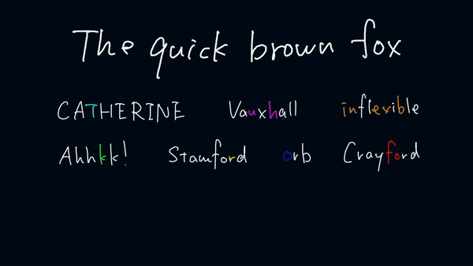
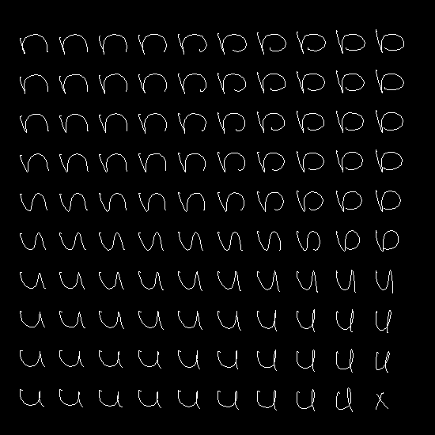
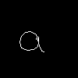

# Generating Handwriting via Decoupled Style Descriptors

[Atsunobu Kotani](http://www.atsunobukotani.com/research/), [Stefanie Tellex](http://cs.brown.edu/people/stellex/), [James Tompkin](www.jamestompkin.com)

ECCV 2020

http://dsd.cs.brown.edu/



We synthesize handwriting (bottom) in a target style (top) via learned spaces of style and content,
and can exploit any available reference samples (middle) to improve output quality.

# License

This project is licenced under the Brown Computer Science Department Copyright Notice, which does not allow commercial use. Plese see details in [here](LICENSE).

# Preparation (Before you run the code)

In the root of a project directory of your choice, create `./model`, `./data`, and `./results` subdirectories.
Then, download our pretrained model from [here](https://drive.google.com/file/d/1oK1yWs3xVsVkZRP_Pr7SSPr3dYXpZwax/view?usp=sharing) and save it under the `./model` directory.

Further, please download the dataset from [here](https://drive.google.com/file/d/1pfUKaYkFu8HpX4f5rlg0spgTk2wwbKzP/view?usp=sharing) and decompress the zip file into the `./data` directory. The folder should be located as `'./data/writers'`.

Finally, please install dependencies with your python virtual environment:

```
pip install -r requirements.txt
```

We tested our codes run in Python 3.8.5 and 3.9.12 without issues.

# Code

You can generate handwriting samples with:

```
python sample.py
```

Please check out [the script](sample.py) for potential arguments.

The provided model has been trained using the following command:

```
python -u main.py --divider 5.0 --weight_dim 256 --sample 5 --device 0 --num_layers 3 --num_writer 1 --lr 0.001 --VALIDATION 1 --datadir 2 --TYPE_B 0 --TYPE_C 0
```

You can also interpolate between pre-set handwriting styles as well as between characters with:

```
python interpolation.py
```

Some notable arguments are:

`--interpolate`:
Allows the user to choose whether to interpolate between characters or writer styles as well as to adjust the randomness (MDN sampling)

`--output`:
The program can output a video of the interpolation, a single image, or a grid of characters.

To specify the word used for interpolation, a list of characters to be interpolated, or the characters at the corners of the grid, use `--target_word`, `--blend_chars`, or `--grid_chars` respectively.

`--writer_ids`:
A list of (0 to 169) representing the ids of writer styles to use

`--writer_weights`:
How much to weight each of the writers (typically summing to 1)

`--max_randomness`:
Adjusts the maximum amount of randomness allowed (clamps the MDN sampling at a percent of the distribution)

`--scale_randomness`:
Adjusts scale of the randomness allowed (scales the standard deviations of MDN sampling)

In addition, we have provided some convenience functions in `style.py` that can be used to extract the style/character information as well as recombine them into the desired image or video.

# Example Interpolations:

A video interpolation between writers 80 and 120 generated with the following command:

```
python interpolation.py --interpolate writer --output video --writer_ids 80 120 --target_word "hello world"
```

Result


A grid that interpolates bilinearly between four letters, one at each corner can be generated with the following command:

```
python interpolation.py --interpolate character --output grid  --grid_chars x b u n
```

Result:



Character interpolation between the first few letters of the alphabet:

```
python3 interpolation.py --interpolate character --output video --blend_chars a b c d e
```

Result:


# Insights

The current model, as published at ECCV 2020 and for consistency with it, does not include a supervised character loss.
Adding this can improve quality in cases where generation does not terminate as expected (characters run on).

# BRUSH dataset

This is the BRUSH dataset (BRown University Stylus Handwriting) from the paper "[Generating Handwriting via Decoupled Style Descriptors](http://dsd.cs.brown.edu/)" by Atsunobu Kotani, Stefanie Tellex, James Tompkin from Brown University, presented at European Conference on Computer Vision (ECCV) 2020. This dataset contains 27,649 online handwriting samples, and the total of 170 writers contributed to create this dataset. Every sequence is labeled with characters (i.e. users can identify what character a point in a sequence corresponds with.

The BRUSH dataset can be downloaded from
[this link](https://drive.google.com/file/d/1NIIXDfmpUhI6i80Dg2363PIdllY7FRVQ/view?usp=sharing) (compressed ZIP 566.6MB). (The original dataset used for ECCV paper is also in [here](https://drive.google.com/file/d/1pfUKaYkFu8HpX4f5rlg0spgTk2wwbKzP/view?usp=sharing), which has slightly less cleaning and fewer alternative resamplings.)

## Terms of Use

The BRUSH dataset may only be used for non-commercial research purposes.
Anyone wanting to use it for other purposes should contact [Prof. James Tompkin](www.jamestompkin.com).
If you publish materials based on this database, we request that you please include a reference to our paper.

```
@inproceedings{kotani2020generating,
  title={Generating Handwriting via Decoupled Style Descriptors},
  author={Kotani, Atsunobu and Tellex, Stefanie and Tompkin, James},
  booktitle={European Conference on Computer Vision},
  pages={764--780},
  year={2020},
  organization={Springer}
}
```

## Data specification

Each folder contains drawings by the same writer, and each file is compressed with Python 3.8.5 pickle as it follows.

```{python}
import pickle
with open("BRUSH/{writer_id}/{drawing_id}", 'rb') as f:
  [sentence, drawing, label] = pickle.load(f)
```

Each file is comprised of the following data.

1.  **Target sentence** -- a text of length (M).

    If a sample is a drawing of "hello world", for instance, this value would be "hello world" and
    M=11 as it is.

2.  **Original drawing** -- a 2D array of size (N, 3).

    We asked participants to write specific sentences in a box of 120x748 pixels, with a suggested
    baseline at 100 pixels from the top, 20 pixels from the bottom. As every drawing has a different
    sequence length, N can vary, and each point has 3 values; the first two are (x, y) coordinates
    and the last value is a binary end-of-stroke (eos) flag. If this value were 1, it indicates that
    the current stroke (i.e. curve) ends there, instead of being connected with the next point, if
    it exists.

3.  **Original character label** -- a 2D array of size (N, M).

    For every point in a sequence, this variable provides an one-hot vector of size (M) to identify
    the corresponding character.

As different writers used different kinds of a stylus to produce their data, the sample frequency (i.e.
the number of sampled points per second) varies per writer. For our original drawing data, we sampled
points at every 10ms (0.01s) by interpolating between points.


In this example drawing, N=689 and M=19 (i.e. 'qualms politics ;[A'). Different colors indicate different character labels.

## Additional formats

We also included few other versions of resampled data. Both versions contain 5x rescaled drawings and
sacrifice temporal information in exchange for a consistence distance between points in a sequence.

1.  **"BRUSH/{writer_id}/{drawing_id}\_resample20"**

    Points are resampled in a way that they are distant from their previous point in a stroke sequence
    at maximum of 20 pixels.
    
    In this resampled drawing, N=449 and M=19 (i.e. 'qualms politics ;[A').

2.  **"BRUSH/{writer_id}/{drawing_id}\_resample25"**

    Points are resampled in a way that they are distant from their previous point in a stroke sequence
    at maximum of 25 pixels.
    
    In this resampled drawing, N=360 and M=19 (i.e. 'qualms politics ;[A').
